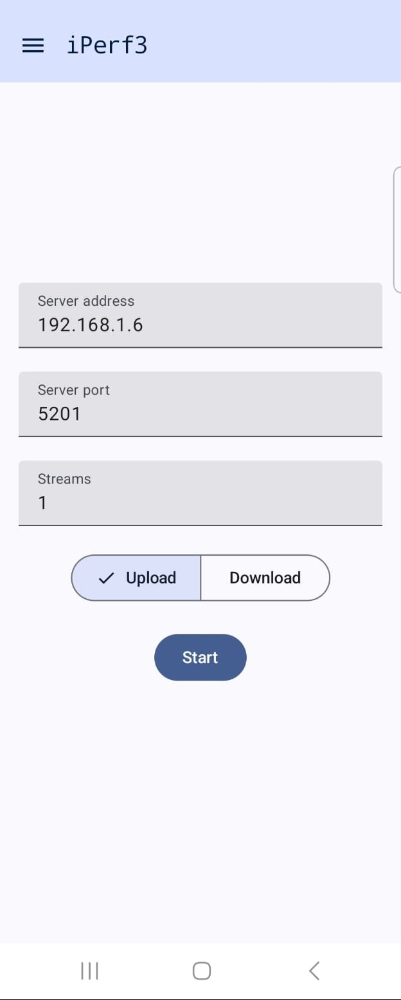
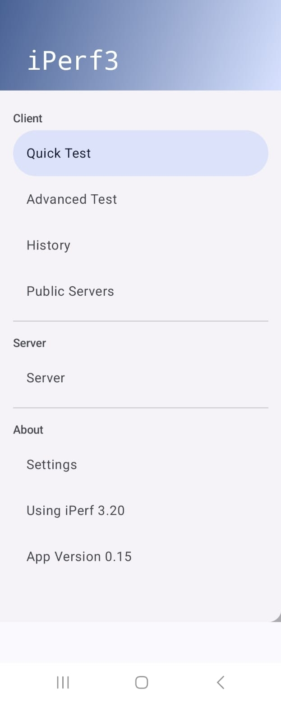
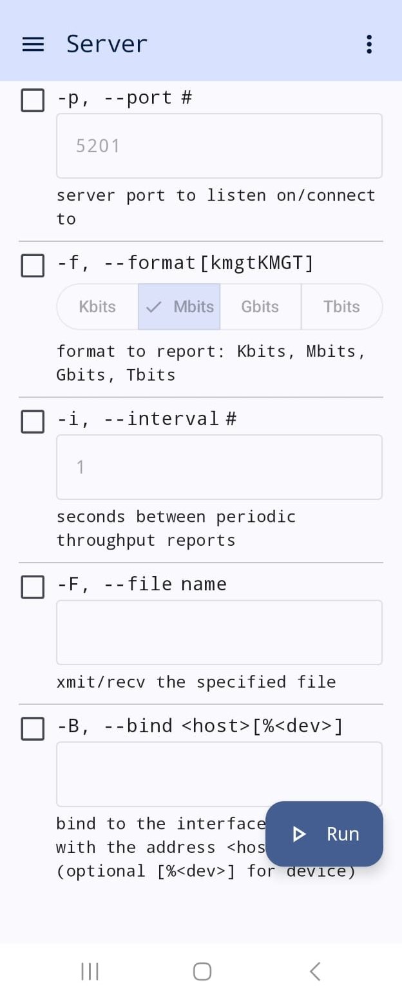

# Download and process data

Clone the repository:
```bash
git clone https://github.com/pietrocariola/BeamHAR-SVR.git
cd BeamHAR-SVR
```

Download the dataset from IEEE DataPort (inside BeamHAR-SVR/)

Clone forked WIBFI repository (inside BeamHAR-SVR/):
```bash
git clone https://github.com/pietrocariola/wibfi.git
```

To process data:
```bash
./process.sh
```
adjusting the code in `process.sh` for the desired scenarios, persons, and sessions.

# To reproduce the experiment

Run on the monitor computer:
```bash
./monitor.sh
```
changing `network_name` for the actual name of the network, `password` for the network password, and `wlp8s0` by the name of the network device in your computer (find the wireless device by running `ip a` on terminal).

To exit monitor mode (after finishing the experiment):
```bash
./managed.sh
```
also changing `wlp8s0` for your device's name.

Start iperf3 on the other computer:
```bash
./iperf.sh
```
changing server's settings and traffic configurations (IP, bitrate, packet length, protocol) inside `iperf.sh` script.

On the server (mobile phone) side click on the top left menu button:



Click on `Server`:



Click on the bottom right `Run` button:


